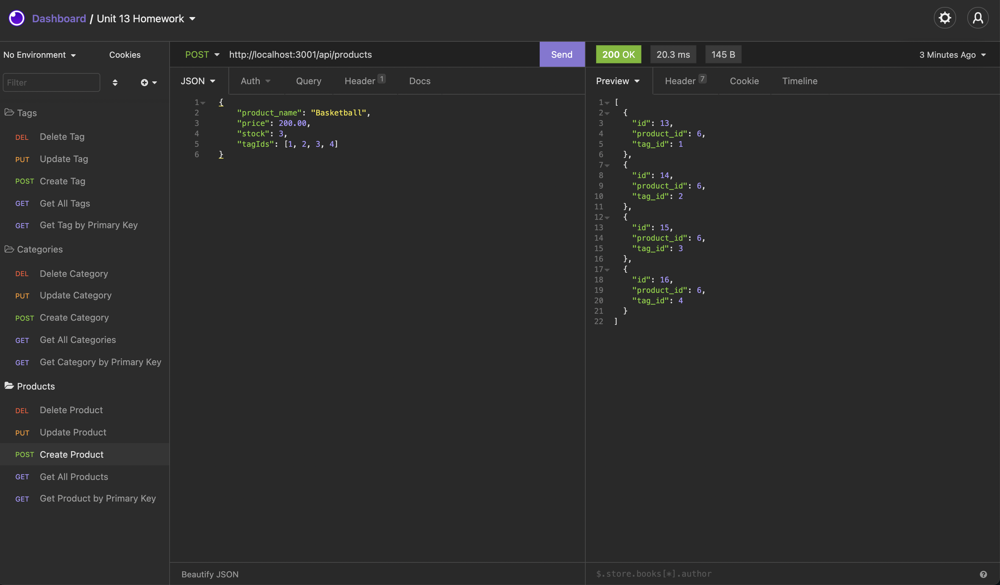
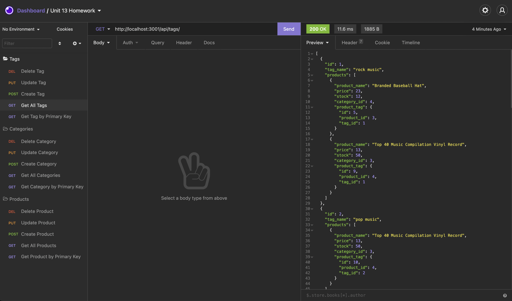

# E Commerse Backend Application

## Table of Contents
- [Description](#Description)
- [Usage](#Usage)
- [Walkthrough](#Walkthrough)
- [Screenshot](#Screenshot)
- [License](#License)
- [Languages](#Languages)
- [Questions](#Questions)

## Description
In this application you can build the back end for an e-commerce or internet retail site by modifying the starter code. Using Express.js and sequelize, you can manipulate the information in the tables in the database. As shown in the walkthrough video below, I will use insomnia, I will demonstrate the CRUD operations created in the different routes.

## Usage
To quickly make changes to an e commerse database

## Walkthrough
[Link to Video](https://watch.screencastify.com/v/kNOPObdcWEJEFFxJNRCd)

## Screenshot

-------

## License
MIT 

## Languages
JavaScript, Node.js, and Sequelize

## Questions
Please contact me at lauraRweiner@gmail.com if you have any questions or suggestions.